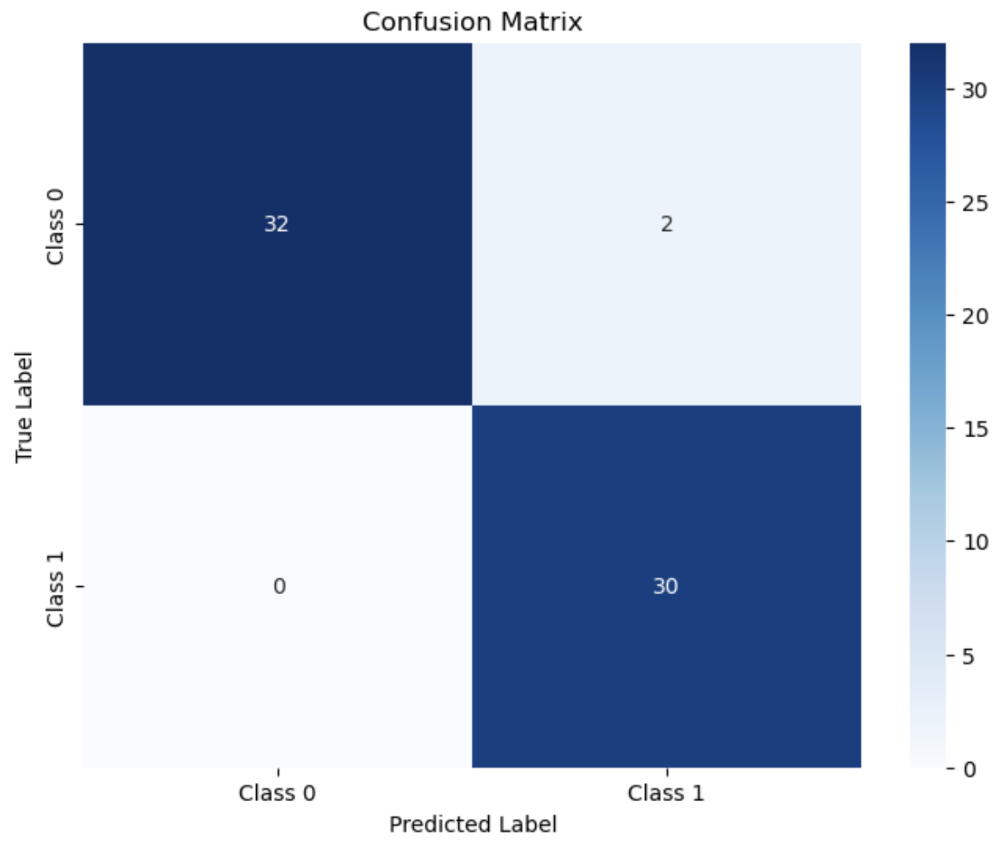
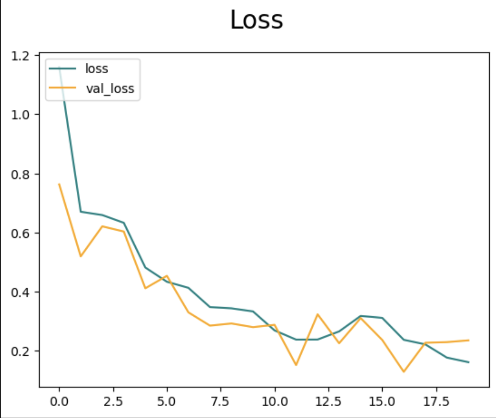
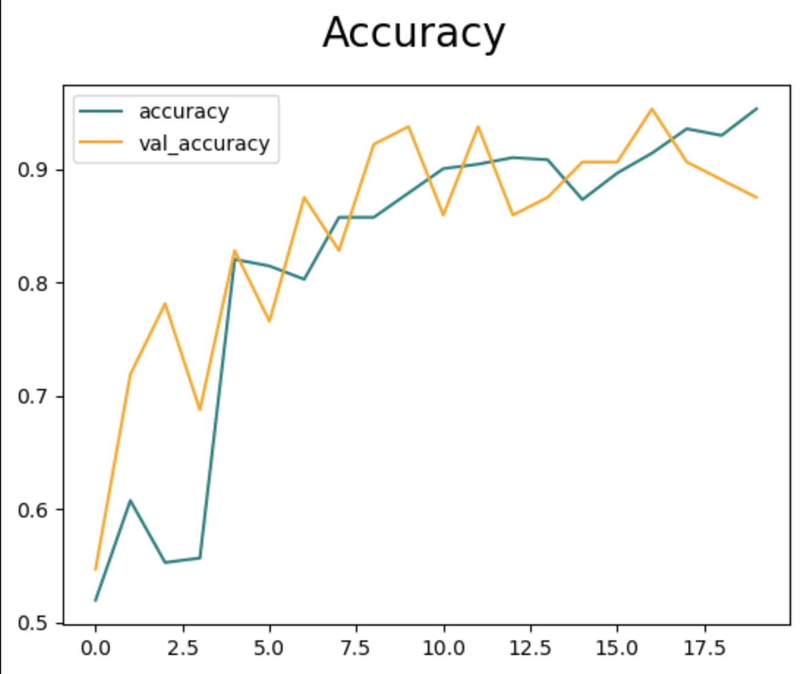
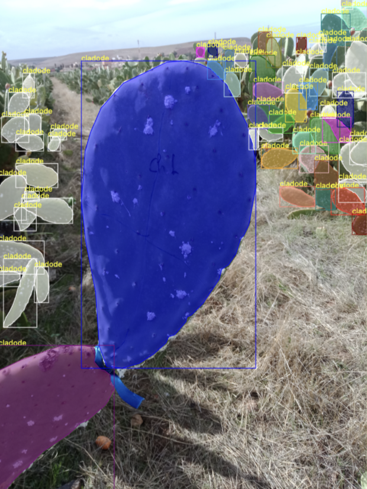
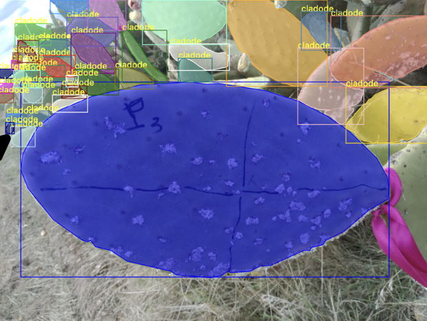
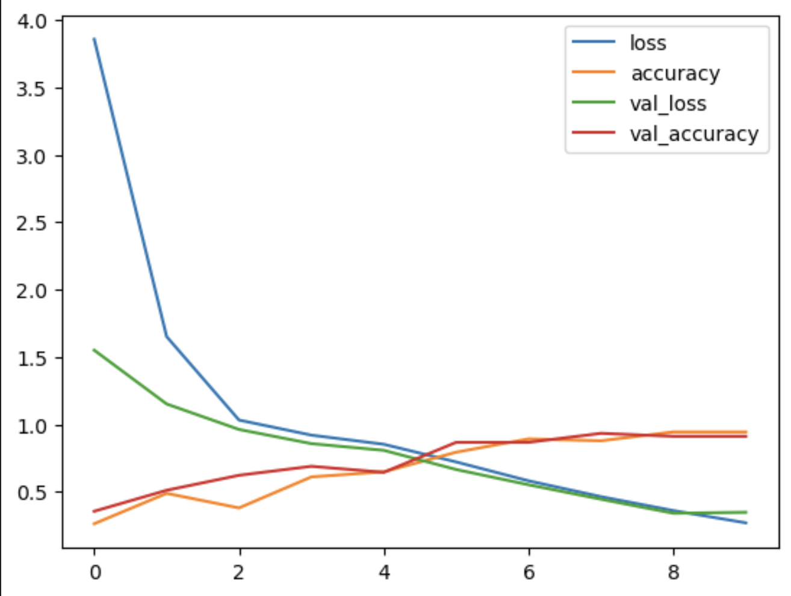

# 🌵 Cactus Cochinneal Detection & Classification 

This project delivers a comprehensive AI pipeline for detecting and classifying cactus infections caused by cochineal insects from drone shot images. It combines **binary classification**, **infection stage classification**, and **image segmentation** as well as **object detection**, all applied to a **private dataset collected via drone imagery**.

> 🔐 **Note**: The dataset and some code components are **not shared** due to privacy agreements.

---

## 🎯 Project Objectives

- Detect early signs of cochineal cactus infection using drone images.
- Segment and localize infected zones precisely.
- Classify the infection into distinct severity levels (mild, moderate, severe).
- Provide detailed model performance metrics to ensure real-world applicability.

---

## 🛠️ Technologies & Libraries Used

```yaml
core:
  - numpy                # Array operations
  - pandas               # Tabular data handling
  - matplotlib, seaborn  # Plotting and visualization

classical_ml:
  - scikit-learn         # Metrics, train-test split, classification tools

deep_learning:
  - torch                # PyTorch for model building
  - torchvision          # Pretrained models (ResNet-18, transforms)
  - detectron2           # Object detection and instance segmentation
  - segmentation_models_pytorch:
      - UNet             # For pixel-wise segmentation
      - DeepLabV3        # Alternative segmentation backbone

augmentation:
  - albumentations       # Image augmentations: flips, crops, rotations, elastic transforms

utils:
  - tqdm                 # Progress bars
  - PIL                  # Image preprocessing
```

---

## 📂 Project Structure

```yaml
root/
├── Detection_infection.ipynb               # Binary classifier (infected or not)
├── Classification_phases_dinfection.ipynb  # Segmentation + stage estimation
├── models/                                 # Checkpoints: ResNet, UNet, Mask RCNN
├── results/                                # Inference outputs, predictions
├── metrics/                                # Confusion matrix, loss/acc curves, IoU metrics
├── README.md                               # This file
```

---

## 🚀 Binary Image Classification

- **Backbone**: ResNet-18 (torchvision)
- **Augmentations**: Resize, Normalize, Flip, Crop via `albumentations`
- **Loss Function**: `CrossEntropyLoss`
- **Optimizer**: `Adam`
- **Evaluation Metrics**:
  - Accuracy
  - Precision / Recall
  - F1-score
  - Confusion Matrix
  - ROC-AUC Curve

---

### 📊 Visualizations:


**Confusion Matrix**


   
---

**Loss Curve**


  
---

**Accuracy Curve**


  
  
---

## 🧩 Infection Severity Estimation & Image Segmentation

This stage utilizes object detection + pixel-wise segmentation to localize and grade the infection.

### 🔍 Techniques Used:

- **Mask R-CNN** with ResNet-50 FPN (via Detectron2)
- **UNet** (via segmentation_models_pytorch) for full segmentation
- **Label Classes**: Healthy / Mild / Moderate / Severe
- **Loss Functions**:
  - Dice Loss
  - Binary Cross Entropy
  - IoU Loss

### 🧪 Augmentations:

- Horizontal & Vertical Flips  
- Elastic Deformation  
- Random Brightness/Contrast  

### 📈 Performance Metrics:

- **IoU (Intersection over Union)**
- **Dice Score**
- **Pixel Accuracy**
- **Loss / Accuracy tracking**


### 📸 Visual Output Samples:

---
  

---

  

---

## 📊 Multi-Label Classification Model

This auxiliary model handles severity classification with multiple labels:

- **Architecture**: Custom CNN (multi-head) or ResNet + MLP head
- **Activation**: Sigmoid (multi-output)
- **Metrics**:
  - Multi-label Accuracy
  - Average Precision (per class)
  - Precision@K

📉 Combined Accuracy & Loss Evolution:  


 

---

## ⚙️ Setup Instructions

```bash
git clone https://github.com/yben409/Computer-Vision-Cochineal-Detection.git
cd cactus_infection_project

# Setup environment
python3 -m venv venv
source venv/bin/activate

# Install dependencies
pip install -r requirements.txt
```

---

## 📫 Contact

- **Youssef Benaouda** — AI Freelancer
- 📩 benaoudayoussef123@gmail.com
- 💼 [LinkedIn](https://www.linkedin.com)
